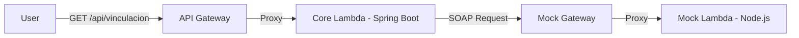

# Proyecto de Vinculación de Empleados (Demo Parameta)

Este proyecto es una solución serverless construida con **Spring Boot 3** y **AWS SAM**, diseñada para gestionar la vinculación de empleados y la integración con sistemas legacy vía **SOAP**.

## 🏗️ Arquitectura

La solución sigue un modelo de microservicios serverless desplegados en AWS:

- **Core Service (Java 21)**: API REST que maneja la lógica de negocio, cálculos de tiempos y validaciones.
- **Legacy Mock (Node.js)**: Simula un sistema antiguo que recibe datos por SOAP.
- **AWS API Gateway**: Expone los endpoints públicos.
- **AWS Lambda**: Ejecuta el código de forma escalable y bajo demanda.



## 🚀 Guía de Instalación Local

### Prerrequisitos
- Java 21
- Maven 3.9+
- AWS SAM CLI
- Docker (opcional, para pruebas locales con SAM)

### Pasos
1. **Compilar el proyecto**:
   ```bash
   mvn clean install
   ```
2. **Ejecutar pruebas unitarias**:
   ```bash
   mvn test
   ```
3. **Ejecutar localmente con SAM**:
   ```bash
   sam build
   sam local start-api
   ```
   El API estará disponible en `http://localhost:3000/api/vinculacion`.

## ☁️ Despliegue en Producción (AWS)

Para desplegar en tu cuenta de AWS:

```bash
sam build
sam deploy --guided
```

## 🧪 Casos de Prueba (Validación en Producción)

Puedes probar el sistema desplegado usando `curl`. Reemplaza `<URL>` por el endpoint generado en el despliegue:

### 1. Registro Exitoso
```bash
curl -i "<URL>/api/vinculacion?names=Juan&lastNames=Perez&documentType=CC&documentNumber=123456&birthDate=1995-01-01&vinculationDate=2022-01-01&position=Dev&salary=5000"
```

### 2. Validación de Edad (Error < 18 años)
```bash
curl -i "<URL>/api/vinculacion?names=Luis&lastNames=Menor&birthDate=2010-01-01&vinculationDate=2025-01-01&..."
```

### 3. Validación de Fechas Futuras
```bash
curl -i "<URL>/api/vinculacion?...&vinculationDate=2030-01-01"
```

## 🛠️ Tecnologías Utilizadas
- **Spring Boot 3.4.1**: Framework principal.
- **Lombok**: Reducción de código repetitivo.
- **Jakarta Validation**: Validaciones de entrada.
- **Spring WS / JAXB**: Comunicación SOAP.
- **AWS Serverless Java Container**: Adaptador para correr Spring Boot en Lambda.
